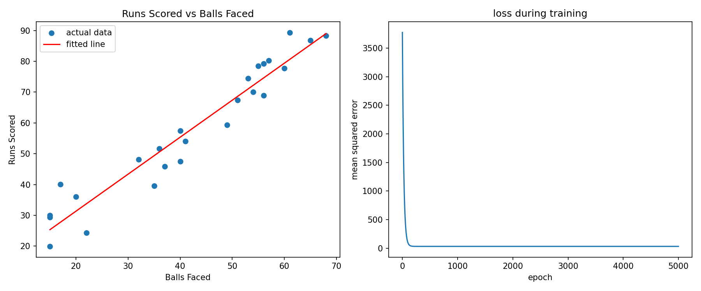

# Linear Regression

---

*HAM ARC ML Sessions, 2026–27.*
*Group: [Aadit](https://github.com/aadit-n), [Wahid](https://github.com/Abdul-Wahid2008), [Jibendra](https://github.com/Galaxyyus).*

## 1. What is it?

Linear regression is a supervised learning algorithm used for **regression** problems, meaning it predicts a continuous number rather than a category. Given an input $x$, we assume there is roughly a *straight-line relationship* between $x$ and the output $y$, and we try to find that line.

Some examples where this shows up:

* Predicting a house's price from its area
* Predicting an exam score from hours studied
* Predicting a batsman's runs scored from balls faced (the example we used below)

## 2. Intuition

If you plot the data as points on a graph, with $x$ on one axis and $y$ on the other, and the points roughly form a straight-line trend, linear regression finds the one straight line that stays as close as possible to all of the points on average.

Once we have that line, we can plug in a new $x$ we have not seen before and get a predicted $y$.

## 3. The model

For a single input feature (simple linear regression):

$$
\mathbf{\hat{y}} = \mathbf{m}\mathbf{x} + \mathbf{c}
$$

where $\hat{y}$ is the predicted value, $x$ is the input, $m$ is the slope, and $c$ is the intercept.

The slope tells us how much $y$ changes for every one-unit increase in $x$. The intercept is the predicted value when $x$ is zero.

With multiple input features (multiple linear regression), this generalises to:

$$
\mathbf{\hat{y}}
=
\mathbf{w}_1\mathbf{x}_1
+
\mathbf{w}_2\mathbf{x}_2
+
\cdots
+
\mathbf{w}_n\mathbf{x}_n
+
\mathbf{b}
$$

The learning part of linear regression is finding the values of $m$ and $c$ (or the weights $w$ and bias $b$) that fit the data best.

## 4. Measuring how good a line is: the cost function

To find the best line, we first need a way to measure how wrong a given line is. The usual choice is **mean squared error (MSE)**:

$$
\mathbf{J}(\mathbf{m}, \mathbf{c})
=
\frac{1}{n}
\sum_{i=1}^{n}
\left(
\mathbf{\hat{y}}_i - \mathbf{y}_i
\right)^2
$$

We square the errors so positive and negative errors do not cancel out, and so that larger mistakes are punished more than small ones.

$J$ is called the **cost function**, or **loss function**. Training the model means finding the $m$ and $c$ that make $J$ as small as possible.

This is also called **ordinary least squares**, since we are minimising the sum of squared residuals.

## 5. Two ways to solve it

### 5.1 Closed form (normal equation)

Because the cost function is a smooth, bowl-shaped curve, we can use calculus directly: take the partial derivatives of $J$ with respect to $m$ and $c$, set them equal to zero, and solve.

This gives an exact formula for the slope:

$$
\mathbf{m}
=
\frac{
\sum_{i=1}^{n}
(\mathbf{x}_i-\mathbf{\bar{x}})
(\mathbf{y}_i-\mathbf{\bar{y}})
}{
\sum_{i=1}^{n}
(\mathbf{x}_i-\mathbf{\bar{x}})^2
}
$$

and the intercept:

$$
\mathbf{c}
=
\mathbf{\bar{y}}
-
\mathbf{m}\mathbf{\bar{x}}
$$

For this simple one-feature case, this gives the optimal line directly without a training loop.

### 5.2 Gradient descent (iterative)

Instead of solving for the optimal parameters directly, we can start from an initial guess and repeatedly nudge $m$ and $c$ in the direction that reduces the cost.

The gradients (partial derivatives of the MSE) are:

$$
\frac{\partial \mathbf{J}}{\partial \mathbf{m}}
=
\frac{2}{n}
\sum_{i=1}^{n}
\left(
\mathbf{\hat{y}}_i-\mathbf{y}_i
\right)
\mathbf{x}_i
$$

$$
\frac{\partial \mathbf{J}}{\partial \mathbf{c}}
=
\frac{2}{n}
\sum_{i=1}^{n}
\left(
\mathbf{\hat{y}}_i-\mathbf{y}_i
\right)
$$

The update rule, applied every epoch, is:

$$
\mathbf{m}
\leftarrow
\mathbf{m}
-
\alpha
\frac{\partial \mathbf{J}}{\partial \mathbf{m}}
$$

$$
\mathbf{c}
\leftarrow
\mathbf{c}
-
\alpha
\frac{\partial \mathbf{J}}{\partial \mathbf{c}}
$$

Here, $\alpha$ is the **learning rate**, which controls how big a step we take during each update.

If it is too small, training takes a very long time. If it is too large, the updates can overshoot the minimum and the loss can blow up instead of going down.

We ran into exactly this while writing the code below. More on that in Section 8.

## 6. Evaluating the model

There are several common metrics for evaluating a regression model:

* **MSE (Mean Squared Error):** the average squared difference between predictions and actual values. Lower is better.
* **RMSE (Root Mean Squared Error):** the square root of MSE. This brings the error back into the original units, making it easier to interpret. For example, an RMSE of $5.6$ means the typical prediction error is around $5.6$ runs.
* **$R^2$ (R-squared):** the fraction of the variance in $y$ explained by the model. A value of $1$ is a perfect fit, while $0$ means the model is no better than always predicting the average of $y$.

The formula for $R^2$ is:

$$
\mathbf{R}^2
=
1
-
\frac{
\sum_{i=1}^{n}
(\mathbf{y}_i-\mathbf{\hat{y}}_i)^2
}{
\sum_{i=1}^{n}
(\mathbf{y}_i-\mathbf{\bar{y}})^2
}
$$

## 7. Assumptions

Linear regression works best, and its statistical guarantees only really hold, when a few assumptions are roughly true:

* **Linearity:** the real relationship between $x$ and $y$ is approximately a straight line.
* **Independence:** each data point does not depend on the others.
* **Homoscedasticity:** the spread of the errors stays roughly constant across the range of $x$, instead of growing or shrinking.
* **Normal residuals:** the errors are roughly normally distributed. This matters more for confidence intervals and $p$-values than for plain prediction.
* **Low multicollinearity:** for multiple regression, the input features should not be too strongly correlated with each other.

## 8. Code

For the dataset we used balls faced and runs scored for a batsman across 25 innings, saved as a small CSV file, `cricket_data.csv` (deliberately not iris).

The relationship is naturally close to linear since more balls faced generally means more runs, roughly according to the player's strike rate, with some match-to-match noise.

We implemented it two ways to check that they agree:

1. **Gradient descent written from scratch**
2. **scikit-learn's built-in `LinearRegression`**

The complete code notebook can be found [here](code/LinearRegression.ipynb)

### Why we standardise $x$

The first version of the gradient descent code trained directly on the raw balls-faced values, which range from roughly 10 to 70.

With a learning rate large enough to converge in a reasonable number of epochs, the updates overshot and the loss went to `NaN` within a few iterations.

The fix is to **standardise $x$** before training:

$$
\mathbf{x}_{\text{scaled}}
=
\frac{
\mathbf{x}-\mathbf{\bar{x}}
}{
\mathbf{\sigma}_x
}
$$

This gives $x$ a mean close to $0$ and a standard deviation of $1$, which makes the gradient updates much better behaved.

After training, we convert the learned slope and intercept back to the original scale.

This is a pretty common thing to trip over when implementing gradient descent from scratch.

### Output

```text
Gradient descent: slope = 1.2016 intercept = 7.3105
Sklearn: slope = 1.2016 intercept = 7.3105
R2 = 0.9275

Prediction for 45 balls faced: 61.4 (gradient descent)
Prediction for 45 balls faced: 61.4 (sklearn)
```

Both approaches land on the same line, which is a good sanity check that the gradient descent implementation is working correctly.

*Plot: the fitted line on the left, and the training loss dropping over epochs on the right.*



## 9. Summary

| **concept**        | **stuff to remember**                                                                                  |
| ------------------ | ---------------------------------------------------------------------------------------------- |
| **Model**          | $y = mx + c$, or $\mathbf{y} = \mathbf{w}\mathbf{x} + b$ for multiple features                 |
| **Cost function**  | Mean squared error, the average squared distance between predictions and actual values         |
| **Training goal**  | Minimise the cost function                                                                     |
| **Closed form**    | Normal equation, gives the exact optimal parameters directly                                   |
| **Iterative**      | Gradient descent, walks downhill on the cost surface with a step size set by the learning rate |
| **Evaluation**     | MSE or RMSE for error size, $R^2$ for variance explained                                       |
| **Key assumption** | The underlying relationship is approximately linear                                            |

## 10. Resources we used

* [StatQuest - Linear Regression, Clearly Explained](https://www.youtube.com/watch?v=nk2CQITm_eo) — about 27 minutes; probably the best single video for the core idea, least squares, and $R^2$.
* [StatQuest - Linear Regression and Linear Models playlist](https://www.youtube.com/playlist?list=PLblh5JKOoLUIzaEkCLIUxQFjPIlapw8nU) — goes further into multiple regression, gradient descent, $p$-values, and related concepts.
* [Learn Linear Regression in Python Like a Pro](https://www.youtube.com/watch?v=x1OezXz8KUI) — theory plus a full code walkthrough.

## 11. Other handy resources for more reading

* [More about the math behind sklearns implementation](https://blog.dailydoseofds.com/p/why-sklearns-linear-regression-implementation)