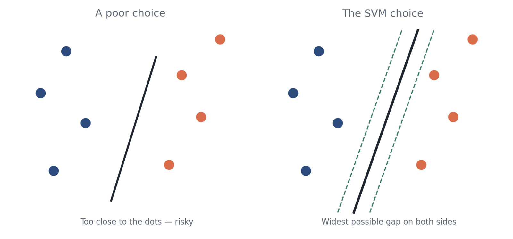
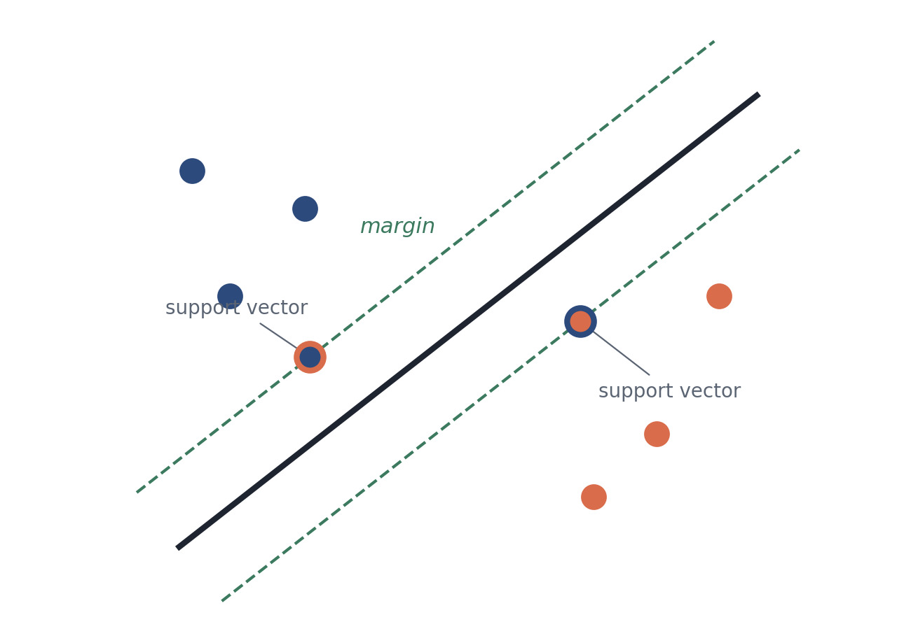
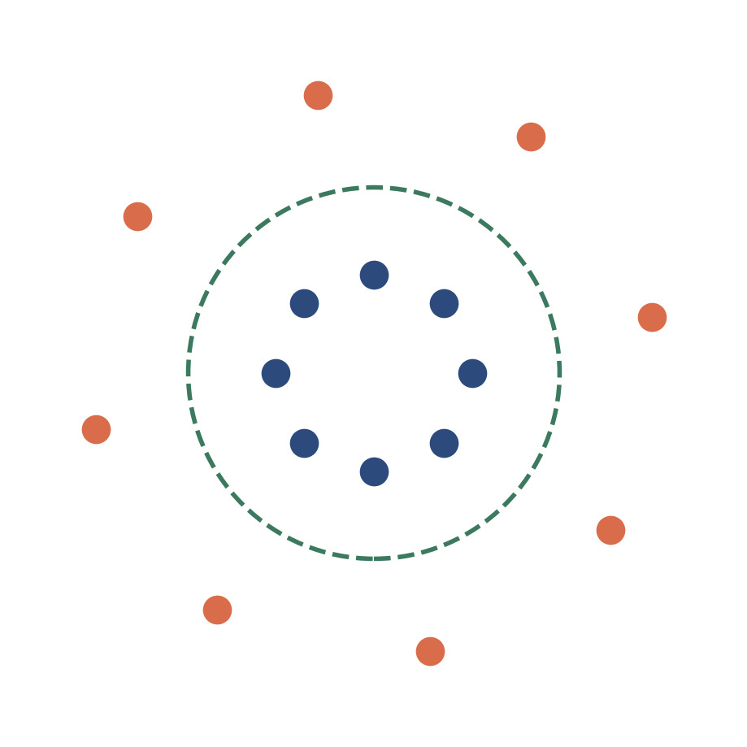

# Support Vector Machines (SVM)
---
*HAM ARC ML Sessions, 2026–27.*
*Group: [Ashvanth](https://github.com/ar25ecb0b52-star), [Fahad](https://github.com/fahdsyd).*

*A simple guide to the algorithm that draws the smartest possible line between two groups.*

---

## The Big Idea

Imagine you have two kinds of dots scattered on a page; say, red dots and blue dots, and you want to draw a line that separates them. A Support Vector Machine (SVM) is a method for finding the *best* possible line to do that.

"Best" doesn't just mean any line that separates the groups. It means the line that sits as far away as possible from the closest dots on either side, giving both groups the most breathing room.

  

<em>Both lines separate the dots - but the right one leaves the most room for error.</em>

---

## Support Vectors & the Margin

The dots closest to the dividing line are the ones that matter most - they're called the **support vectors**, because they "support" or pin down where the line can go. The empty space between the line and these closest dots is the **margin**. SVM's whole job is to make that margin as wide as possible.

  

<em>Only the circled dots decide where the line sits - every other dot could move and the line wouldn't change.</em>

<table width="100%" style="background-color:#DCE6F2; border:none;">
<tr><td style="padding:14px;">
Why this matters: because the line is set by only a few critical points, SVMs tend to generalize well to new, unseen data instead of overfitting to noise.
</td></tr>
</table>

---

## When a Straight Line Won't Work

Sometimes dots are mixed together in a way no straight line can separate - like blue dots surrounded by a ring of red dots. SVM handles this with a clever trick called the **kernel trick**: it lifts the dots into a higher dimension where a flat line (or plane) can separate them, then maps that boundary back down. Think of it like a tablecloth with mixed-up marbles: lift one corner up, and suddenly the red and blue marbles roll apart into layers.

  

<em>No straight line separates these - but a circular boundary (found via the kernel trick) does the job.</em>

---

## Where SVMs Show Up

Because they work well with limited data and high-dimensional inputs, SVMs are popular for tasks like spam email detection, handwriting and image recognition, gene classification in bioinformatics, and sentiment analysis on text.

---

*A one-page primer on Support Vector Machines — for a deeper dive, look up "kernel functions," "soft margin," and "the hinge loss."*